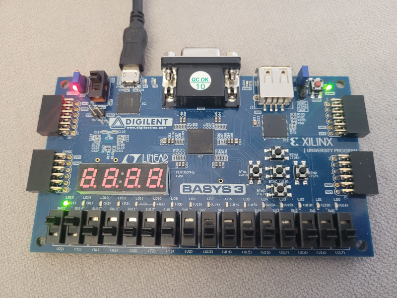

# Learn-Basys-3-board-OpenFPGA
Learning about the Basys-3 FPGA board using Opensource tools
More information on the [wiki](https://github.com/Obijuan/Learn-Basys-3-board-OpenFPGA/wiki)  (In Spanish)

# Puesta en marcha

Para probar los ejemplos tienes que instalar la **toolchain**, que se compone de las [oss-cad-suite](https://github.com/yosyshq/oss-cad-suite-build) y [openxc7](https://github.com/FPGAwars/tools-openxc7)

1. Clona este repositorio

```bash
git clone https://github.com/Obijuan/Learn-Basys-3-board-OpenFPGA.git
```

2. Instalación de las toolchains

Ejecuta este comando:

```bash
curl -L https://github.com/FPGAwars/tools-openxc7/raw/refs/heads/main/install | sh
```

3. Acceder al entorno de la toolchain

Entra en el directorio `Learn-Basys-3-board-OpenFPGA` y ejecuta `. start`

```bash
obijuan@JANEL:~/Develop/Learn-Basys-3-board-OpenFPGA$ . start
───────────────────────────────
Entorno TOOLS-OPENXC7
(c) OPENXC7 Project
(c) Obijuan (FPGAwars, 2026)
───────────────────────────────

[OSS-CAD-SUITE][TOOLS-OPENXC7] ───────────────────────
obijuan@JANEL:~/Develop/Learn-Basys-3-board-OpenFPGA$
```

# Probando el ejemplo hola mundo

Comprueba que todo funciona bien sintetizando el ejemplo 1: El "hola mundo " que enciende el LED15 de la tarjeta Basys3

```bash
cd verilog/01-ledon
make
```

# Cargando el ejemplo en la Basys3

```bash
make prog
```

El LED15 de la Basys3 estará encendido



# Creditos

Las herramientas libres para las FPGAs de Xilinx las tenemos gracias al [Proyecto openXC7](https://github.com/openxc7). Están haciendo un trabajo increible. ¡Muchísimas gracias!

